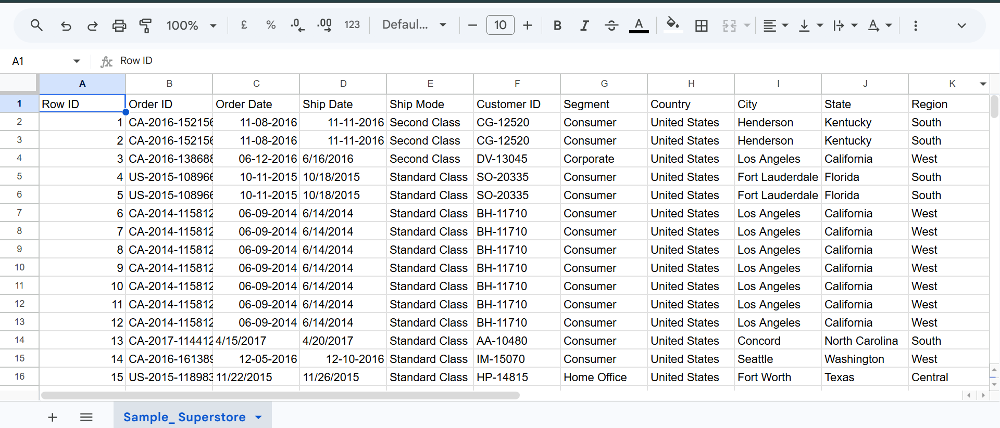
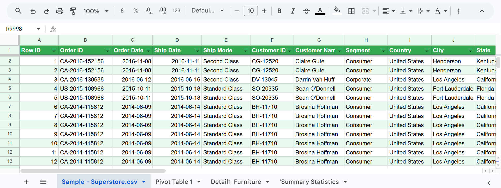
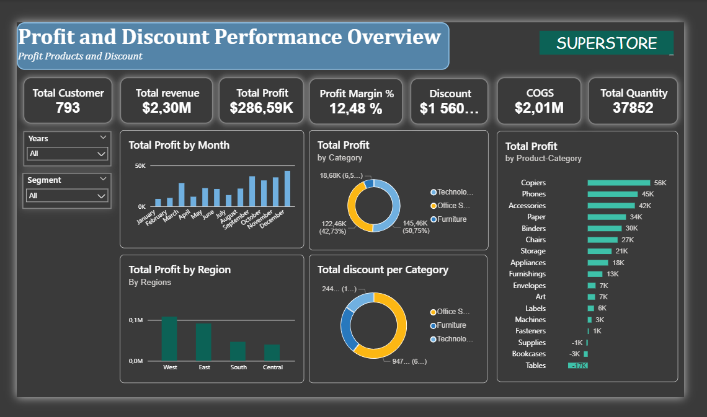
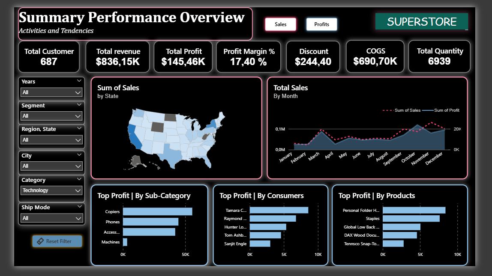
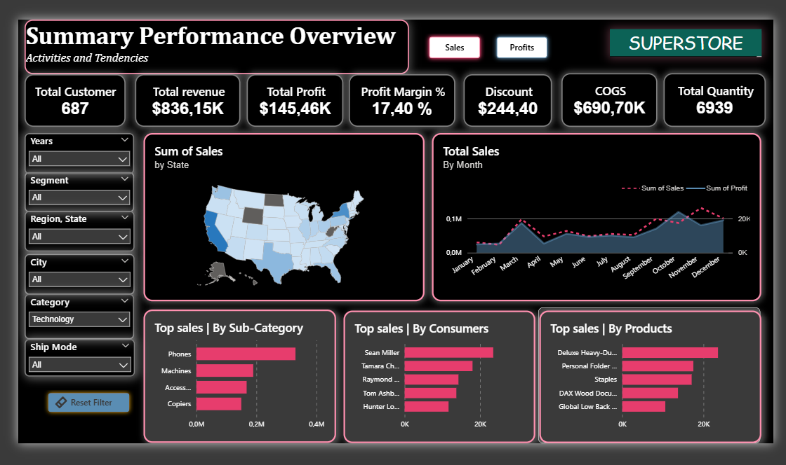

# End-to-End Superstore Data Analysis Project 
## Project Overview
This report summarizes the sales performance of the Superstore dataset using Excel and Power BI, highlighting key trends and insights derived from exploratory data analysis, Pivot Tables, and interactive data visualizations. The analysis focuses on sales, profit, customer behavior, forecasting, regional performance, payment modes, and other key business metrics to support data-driven decision-making.

## Objectives

- Analyze sales and profit performance
- Identify top-performing products and regions
- Understand customer purchasing behavior
- Create interactive dashboards for business insights
- Support data-driven decision-making

## Tools & Technologies Used

Microsoft Excel	: Data cleaning & preprocessing
Pivot Tables	: Exploratory data analysis
Power BI	    : Interactive dashboard creation
GitHub	        : Project documentation & portfolio

## The project workflow included:

**Data Cleaning in Microsoft Excel :**

- Removing duplicates
- Handling missing values
- Formatting dates and columns
- Correcting inconsistent data entries

**Data Exploration using Pivot Tables :**

- Sales by region
- Profit by category
- Monthly sales trends
- Customer purchasing patterns

**Data Visualization in Power BI :**

- KPI Cards
- Sales & Profit Analysis
- Regional Performance
- Customer Insights
- Interactive Filters and Slicers
- Forecasting Visualizations

## Key Insights & Recommendations

### 1. Sales & Quantity Dashboard

.png)

**Key Insights**

- The West region generated the highest sales volume.
- Technology products had the highest sales performance.
- Sales increased significantly during certain months, showing seasonal trends.
- A small number of products contributed heavily to total sales quantity.

**Recommendations**

- Increase inventory for high-demand products.
- Focus marketing campaigns on top-performing regions.
- Prepare seasonal sales strategies during peak periods.
- Introduce promotional bundles for frequently purchased products.

### 2. Profit & Discount Dashboard

**Key Insights**

- High discounts did not always generate high profit.
- Some sub-categories recorded strong sales but low profitability.
- Certain products generated losses due to excessive discounting.
- Excessive discounting reduced profit margins in some regions.

**Recommendations**

- Reduce unnecessary discount rates on low-margin products.
- Focus discounts on products with strong profitability potential.
- Analyze the relationship between discounts and customer retention.
- Use targeted discounts instead of broad promotions.

### 3. Regional & State Performance Dashboard

.png)

**Key Insights**
- Some regions consistently outperformed others in sales and profit.
- Certain states generated high sales but lower profitability.
- Regional demand patterns varied significantly.
- A few locations contributed heavily to overall business performance.

**Recommendations**
- Increase investment in high-performing regions.
- Investigate operational costs in low-profit states.
- Develop region-specific marketing strategies.
- Improve performance in underperforming regions through targeted campaigns.

### 4. Executive Summary Dashboard

### Key Insights
- Overall sales performance showed steady business growth across the years and multiple regions.
- A small percentage of customers contributed significantly to total revenue and profit.
- Certain products consistently generated high sales and strong profitability (like Phones).
- Some high-selling products produced lower profit margins, indicating potential pricing or cost issues.
- Standard Class was the most frequently used shipping mode, suggesting customer preference for cost-effective delivery options.
- Regional performance varied across states, with some locations outperforming others in both sales and profit (like California).
- Sales growth did not always correspond to profit growth, highlighting the importance of profitability analysis alongside revenue tracking.

### Recommendations
- Strengthen customer retention strategies for top-performing customers through loyalty and personalized marketing programs.
- Focus inventory and marketing efforts on high-performing products and categories.
- Review low-profit products with high sales volume to improve pricing or reduce operational costs.
- Optimize shipping operations by improving delivery efficiency and evaluating shipping costs across modes.
- Develop region-specific business strategies to improve underperforming areas.
- Continue monitoring key business KPIs through interactive dashboards to support data-driven decision-making.

## Conclusion

This project demonstrates the complete data analysis workflow, from data cleaning and transformation to exploratory analysis and interactive dashboard development using Excel and Power BI. Through the analysis of the Superstore dataset, valuable insights were uncovered regarding sales performance, profitability, customer behavior, discount impact, and regional trends.

The dashboards provide a clear and data-driven overview of business operations, helping identify high-performing products, profitable regions, and areas requiring strategic improvement. The analysis also highlights the importance of balancing sales growth with profitability and using business intelligence tools to support informed decision-making.

Beyond technical visualization, this project emphasizes analytical thinking, problem-solving, and the ability to transform raw data into actionable insights. It reflects practical skills in data analysis, reporting, dashboard design, and business intelligence that are essential in modern data-driven environments.

This project serves as both a business case study and a demonstration of my growing expertise in data analytics and data visualization.

## Business Value

This analysis helps businesses understand customer behavior, optimize shipping strategies, improve profitability, identify top-performing products, and support strategic decision-making through interactive business intelligence dashboards.

## About Me

I am a passionate data analyst and software engineering graduate with an interest in data science, business intelligence, and technology-driven problem solving. I enjoy transforming raw data into meaningful insights through data cleaning, analysis, and visualization.

My background in software engineering, combined with my growing experience in data analytics, allows me to approach projects with both technical and analytical thinking. I am continuously developing my skills in Excel, Power BI, Python, SQL, and data science to build impactful, data-driven solutions.

I am particularly interested in business analytics, dashboard development, and using data to support strategic decision-making and innovation.

## Contact

- GitHub: (https://github.com/Carlytcheu12)
- LinkedIn: https://www.linkedin.com/in/carlane-tcheuffa-njiena-263941381/